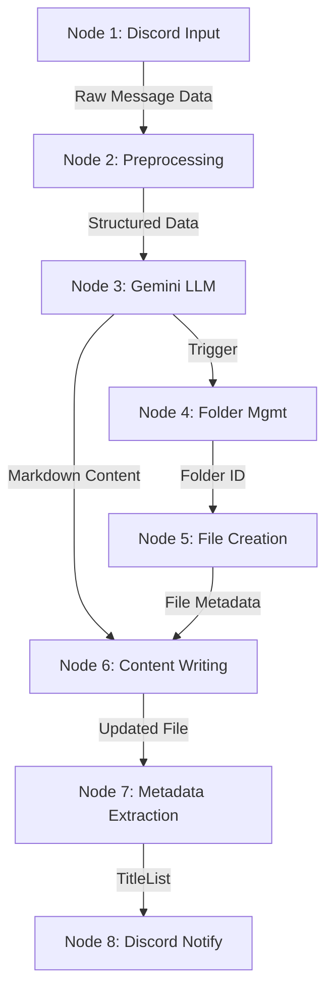

# System Design Document: X Bookmark Summarizer Agent

## 1. System Architecture

The system is designed as a sequential pipeline of nodes, implemented in Python. It orchestrates data flow between external APIs (Discord, Google Gemini, Google Drive) and local processing logic.

### High-Level Diagram


## 2. Component Details

### 2.1. Node 1: Discord Client (Input)
*   **Library**: `discord.py`
*   **Event**: `on_message` (Bot)
*   **Logic**:
    *   Monitor specific Channel ID.
    *   Filter for messages containing X/Twitter URLs.
    *   Retrieve message content and embeds (Discord often expands X links).
*   **Data Structure (Output)**:
    ```json
    {
      "id": "discord_message_id",
      "text": "content_from_embed_or_message",
      "url": "original_x_url",
      "media_urls": ["image_url1", "image_url2"],
      "created_at": "timestamp"
    }
    ```

### 2.2. Node 2: Data Preprocessing
*   **Logic**:
    *   Clean text (remove extra Discord formatting).
    *   Handle cases where embed is missing (might need fallback or skip).
    *   Format prompt for LLM.

### 2.3. Node 3: Gemini LLM Integration
*   **Library**: `google-generativeai`
*   **Model**: `gemini-2.5-flash`
*   **Configuration**:
    *   `temperature`: 0.7
    *   `top_p`: 0.95
*   **System Prompt**: Defined in `system_prompt.md`.
*   **Input**: User Prompt constructed from Node 2 data.
*   **Output**: Markdown string.

### 2.4. Node 4: Folder Management
*   **Library**: `google-api-python-client` (Drive API v3)
*   **Logic**:
    *   Get current date (e.g., `2024-12`).
    *   Query Drive: `mimeType = 'application/vnd.google-apps.folder' and name = '2024' and parents in 'ROOT_FOLDER_ID'`.
    *   If not found, `files.create` with `mimeType`.
*   **Output**: `folder_id`.

### 2.5. Node 5: File Creation
*   **Library**: `google-api-python-client`
*   **Logic**:
    *   `files.create`
    *   `name`: `{First Line of Content}.md` (Cleaned to be file-system safe)
    *   `parents`: `[folder_id]`
    *   `mimeType`: `text/markdown` (or `application/vnd.google-apps.document`).
*   **Output**: `file_id`, `web_view_link`.

### 2.6. Node 6: Content Writing
*   **Library**: `google-api-python-client` (`files.update` or `media_upload`)
*   **Logic**:
    *   Upload content string to `file_id`.
*   **Output**: Success status, `file_object`.

### 2.7. Node 7: Metadata Extraction
*   **Logic**:
    *   Parse the first line of the generated markdown.
    *   Store in a local JSON/Database or append to a runtime list.
    *   Structure: `{"title": "First Line", "url": "drive_link", "timestamp": "now"}`.

### 2.8. Node 8: Discord Notification
*   **Library**: `discord-webhook` or `requests` (or reuse `discord.py` client if running continuously)
*   **Logic**:
    *   Filter `TitleList` for items where `timestamp > (now - 8h 10m)`.
    *   Construct payload:
        ```json
        {
          "content": "## New Summaries\n- [Title](DriveLink)\n- [Title](DriveLink)"
        }
        ```
    *   POST to Webhook URL (or send via Bot).
    *   **Schedule**: This logic runs at the end of every pipeline execution (every 3 minutes), notifying only if new items were processed in that run.

## 3. Data Storage & State Management
*   **State**: Minimal state needed.
    *   `processed_message_ids`: To avoid re-processing same Discord messages.
*   **Credentials**:
    *   `.env` file for API Keys (DISCORD_TOKEN, GEMINI_API_KEY, DISCORD_WEBHOOK_URL).
    *   `credentials.json` for Google Service Account.

## 4. Error Handling
*   **API Limits**: Implement rate limiting for Discord (though high limits) and Gemini.
*   **Content Safety**: Catch Gemini safety filter exceptions.
*   **Network**: Retry logic for Drive uploads.

## 5. Security
*   **Secrets**: Never commit `.env` or `credentials.json`.
*   **Scope**: Restrict Google Drive scope.
